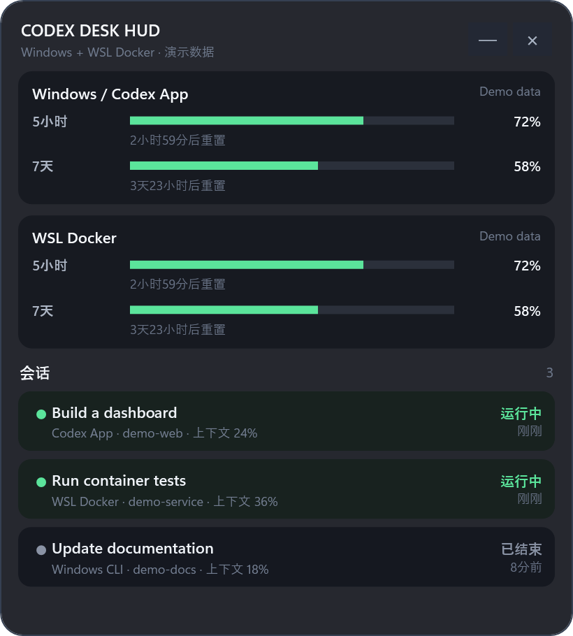

# Codex Desk HUD

**English** | [简体中文](README.zh-CN.md)

A small, always-on-top Windows window for **Codex on Windows and inside a WSL Docker container**. See remaining allowance and recent task states without switching between the desktop app and terminals.



*Actual WPF interface rendered with fictional demo tasks and percentages. No personal session data is included. The current application UI is Chinese; the documentation is bilingual.*

## Why this project?

The focus is a mixed environment: **one Windows Codex profile + one Docker container reached through WSL, shown together**. The implementation is plain PowerShell/WPF, with Node.js or Python probes inside the container. There is no frontend build step for the Windows HUD.

| Project | Documented focus | Where this project differs |
| --- | --- | --- |
| [Codex Monitor HUD](https://github.com/LH-03/codex-monitor-hud) | Windows Desktop/VS Code/CLI task overlay, richer display modes | Codex Desk HUD adds an explicit WSL → Docker probe path in its smaller script-based implementation. |
| [codex-monitor-windows](https://github.com/itsnitinr/codex-monitor-windows) | Account usage and switching, native Windows or WSL targets | Codex Desk HUD combines recent task rows with quota cards from Windows and a Docker target. It does not manage account switching. |

Comparison based on the linked READMEs reviewed on 2026-09-09. This is a difference in focus, not a claim that other projects cannot support these workflows or that this is the first such tool.

## Features

- Always-on-top, draggable WPF overlay, adjustable opacity and tray hide/show.
- Recent sessions from Windows Codex App/CLI and an optional WSL Docker container.
- Running, completed, aborted, stale or unknown states inferred from local rollout events.
- Remaining percentages and reset times reported by `codex app-server`; only returned windows are shown.
- Clearly labeled rollout-cache fallback when the live quota request fails.
- Hidden launcher, optional desktop/startup shortcuts and local diagnostic logs.
- Bounded Windows log-tail reads and drained app-server stderr to avoid the startup stalls fixed in this release.

## Quick start

Requirements: Windows with Windows PowerShell 5.1 and WPF; installed, signed-in Codex for live allowance. Optional Docker monitoring needs WSL, a running container, Codex inside it, and **Node.js or Python 3** inside the container.

1. Download this repository as a ZIP and extract it, or clone it.
2. Double-click `Start-CodexDeskHUD.vbs` (or `.cmd`). The first launch copies `config.example.json` to a local `config.json`.
3. Docker monitoring is disabled by default. Enable and configure it in your local `config.json` if needed.

Optional installation from Windows PowerShell:

```powershell
powershell.exe -NoProfile -ExecutionPolicy Bypass -File .\Install.ps1 -DesktopShortcut
# Add -AutoStart to create a startup shortcut.
```

The installer uses `%LOCALAPPDATA%\CodexDeskHUD` and preserves an existing installed `config.json`. `Uninstall.ps1` removes the shortcuts; close the HUD and remove the installation folder separately if desired.

## Configuration

Only the generic [`config.example.json`](config.example.json) is tracked. Keep machine-specific values in ignored `config.json`.

| Setting | Meaning |
| --- | --- |
| `Windows.CodexHome` | Session directory root; blank uses the Windows user profile's `.codex`. |
| `Windows.CodexCommand` | Codex executable path; blank attempts automatic discovery. |
| `Docker.Enabled` | Enable the WSL Docker source. Default: `false`. |
| `Docker.WslDistro` | Distribution name from `wsl -l -q`; blank attempts discovery. |
| `Docker.Container` | Running container name from `docker ps`; blank selects a single candidate. |
| `Docker.CodexHome` | Container session directory root; blank uses its environment/home. |
| `Docker.CodexCommand` | Container executable, normally `codex`; use its absolute path if absent from Docker exec's PATH. |
| `RefreshSeconds` / `QuotaRefreshSeconds` | Polling delay / quota refresh interval (defaults: 3 / 90 seconds). |
| `MaxSessionsPerSource` | Maximum recent sessions per source (default: 8). |
| `RunningStaleMinutes` | Age threshold for a running session to become uncertain (default: 30 minutes). |

The session root and the account used by the executable must correspond. In this version, a custom session root does not automatically select another quota account. Run the executable with the intended Codex environment. Windows and Docker percentages are not added together; the same account can appear twice.

## Limitations and troubleshooting

- This is a small early-stage utility. Session state comes from logs, not a live process guarantee. A long task with no new events may appear stale; older events outside the bounded tail may be unknown. Source labels are heuristic.
- The worker polls sequentially. Sessions are published before quota calls, but a slow remote call still delays the next poll. The configured delay is not an exact update cadence.
- Cached quota is historical and may be outdated. A missing quota window is not interpreted as 100% remaining. Live quota requires the target to reach the Codex service.
- One Windows profile and one WSL Docker container are supported per instance. Direct SSH and multiple Docker containers are not implemented.
- VBS can be disabled by Windows policy. `Install.ps1` attempts to build a small native launcher; alternatively run `CodexDeskHUD.ps1` with Windows PowerShell.
- For diagnostics, run `Debug-CodexDeskHUD.cmd` and inspect `%LOCALAPPDATA%\CodexDeskHUD\worker.log`. If the container cannot reach the service, fix its network/proxy configuration independently.
- WSL Docker probing falls back from Node.js to Python 3. A Node probe error can therefore be harmless when Python succeeds.

## Privacy

No telemetry or project-operated backend. The worker reads local session metadata and log tails, which can contain conversation text; derived titles/statuses are written to local status files. Codex handles authentication and the live account request. HUD code does not export credentials or upload session records. Logs and screenshots may expose paths, task names or usage: sanitize them before sharing. See [PRIVACY.md](PRIVACY.md).

## Development

```powershell
powershell.exe -NoProfile -ExecutionPolicy Bypass -File .\tests\Test-Core.ps1
powershell.exe -STA -NoProfile -ExecutionPolicy Bypass -File .\docs\Render-Demo.ps1
```

The offline test uses synthetic fixtures, without a Codex login, WSL, or your session files. The demo renderer uses the actual HUD controls with fabricated data. Contributions and reproducible, sanitized bug reports are welcome.

MIT licensed. An independent community project, not affiliated with OpenAI. See [LICENSE](LICENSE).
